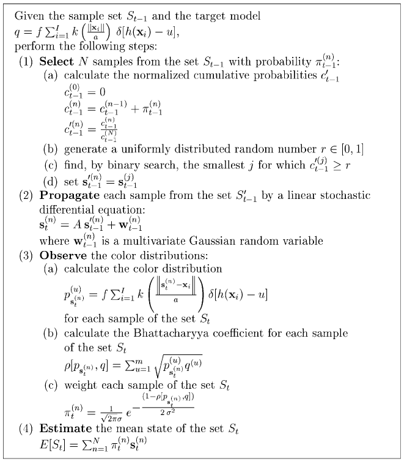

# Particle Filter

This repo implements a particle filter based object tracking algorithm, file ``` test.avi``` is a demo showing tracking box and particles, our implementation referenced paper [《An adaptive color-based particle filter》](https://www.sciencedirect.com/science/article/pii/S0262885602001294)

 Here is the pesudocode



**Prerequisets**

- cv2
- numpy

To run this code, just run ```main.py``` like ```python main.py```, this will generate a series of pics in folder  ```output```, you can use some scripts to transform these pics into a video

You can tune parameters in file ```ParticleFilter.py```, like particle nums, Gaussian distribution's $\mu,\sigma$ and color histogram's parameters etc.

Here is one frame in the tracking process

