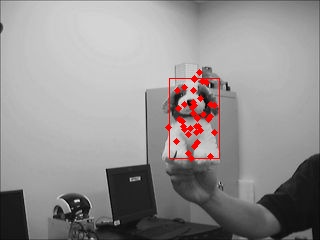

# Particle Filter

This repo implements a particle filter based object tracking algorithm, file ``` test.avi``` is a demo showing tracking box and particles, our implementation referenced paper [《An adaptive color-based particle filter》](https://www.sciencedirect.com/science/article/pii/S0262885602001294)

 Here is the pesudocode


**Prerequisets**

- cv2
- numpy

To run this code, just run ```main.py``` like this

```python main.py```

You can tune parameters in file ```ParticleFilter.py```, like Gaussian distribution's $$\mu,\sigma$$ and color histogram's parameters etc.

Here is one frame in the tracking process



